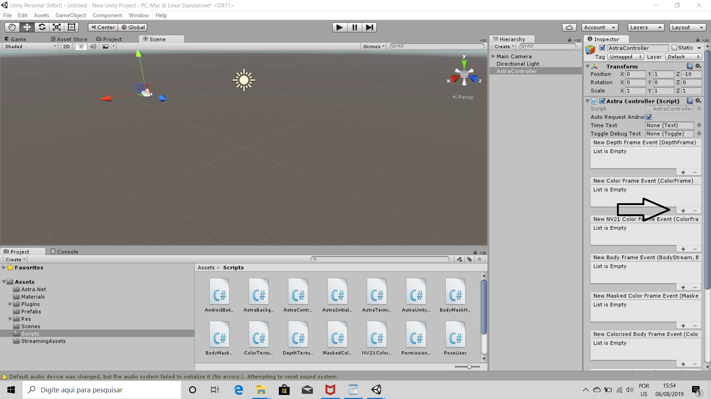

# Tutorial para utilizar a camera ORBBEC no unity

[Instalando o driver da camera](#instalando-o-driver-da-camera-no-computador)

[Fazendo download do pacote de assets](#fazendo-download-do-pacote-de-assets)

[Como obter a imagem RAW da Câmera](#como-obter-a-imagem-raw-da-câmera) 

[Importando o pacote de assets](#importando-o-pacote-de-assets-para-unity)

[Adicionando o Controle da Câmera](#adicionando-o-controle-da-câmera)

## Instalando o driver da camera no computador

Para o reconhecimento e funcionamento da Câmera ORBBEC ASTRA no computador, é necessário instalar drives da câmera. Para isso, deve-se acessar o site dos [desenvolvedores da ORBBEC](https://orbbec3d.com/develop/) e realizar o download dos drives compatíveis com a câmera e o sistema operacional do computador, conforme mostrado na Figura 1.

  
 Figura 1. Download dos drivers na pagina do desenvolvedor da Orbecc.

## Fazendo download do pacote de assets

No mesmo site citado anteriormente, está disponível o pacote de assets necessarios para o funcinamento da camera na plataforma Unity,de acordo com a Figura 2. (OBS: Necessário instalar a versao 5.3.6 da [Unity](https://unity3d.com/pt/get-unity/download/archive))

  
 Figura 2. 

 
 

## Importando o pacote de assets para Unity

Depois de baixado e instalado o drive da câmera, importe do pacote de assets para Unity, como mostram as figuras de 3 a 5.

  
 Figura 3.

 

  
 Figura 4.

  
 Figura 5.

 

## Como obter a imagem RAW da Câmera 

Feito todo o processo de instalação e depois de aberto o unity, crie um novo objeto na aba “Main Camera”, conforme a figura 6.

  
 Figura 6.

 

Na aba do objeto criado, clique na opção “Add Component” e logo após na opção “Mesh”,segundo a figura 7.

  
 Figura 7.

 

Selecione o “Mesh Filter”, em seguida clique no círculo que irá aparecer do lado direito da tela e depois selecione a opção “Quad” para que se crie a caixa onde aparecerá a imagem da câmera como mostram as seguintes, como apresentado nas figuras de 8 a 10.

  
 Figura 8.

 

  
 Figura 9.

 

  
 Figura 10.

 

Para renderizar a imagem da câmera adicione outro componente chamado “Mesh Renderer” no mesmo objeto criado anteriormente, conforme mostra a Figura 11.

  
 Figura 11.

 

Após adicionar o Mesh Renderer, na aba “Cast Shadows” coloque em “Off” juntamente com a aba “Reflection Probes”, desmarque as caixas “Receive Shadows” e “Use Light Probes”, clique na opção “Materials” e depois no círculo na parte direita da tela e selecione a “Unlit Texture” como está apresentado nas seguintes, de acordo com as figuras de 12 a 14.

  
 Figura 12.

 

  
 Figura 13.

                                                                                                                         

  
 Figura 14.

 

Selecione a pasta scripts dentro do pacote de assets que foi adicionado no início do tutorial e escolha o script “Color Texture Renderer”, em conformidade com a figura 15.

  
 Figura 15.

 

## Adicionando o Controle da Câmera

Crie um novo objeto fora da pasta “Main Camera” e adicione um script chamado “Astra Controller”, consoante com as figuras 16 e 17.
 

  
 Figura 16.

 

  
 Figura 17.

                                                                                                                         

No objeto criado e com o script selecione a opção “New Color Frame Event” e clique no “+”, em seguida escolha o objeto criado no início do tutorial na aba “Main Camera”, tal qual as figuras 18 e 19.

  
 Figura 18.

 

  
 Figura 19.

 

Clique na aba “No function”, selecione a opção “Color texture renderer” e em seguida a opção “On new frame”, segundo a figura 20.

  
 Figura 20.

 

Após, selecione a aba “Runtime Only” e marque a opção “Editor and Runtime”, como apresenta a figura 21.

  
 Figura 21.

 
 
[Voltar para o inicio](#tutorial-para-utilizar-a-camera-orbbec-no-unity)
