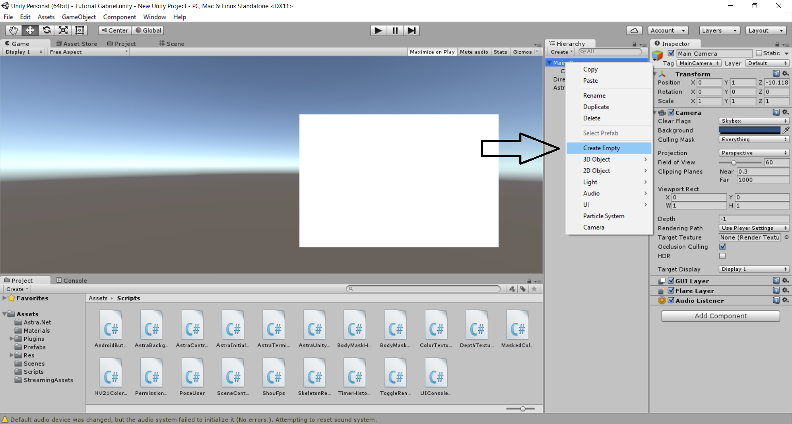
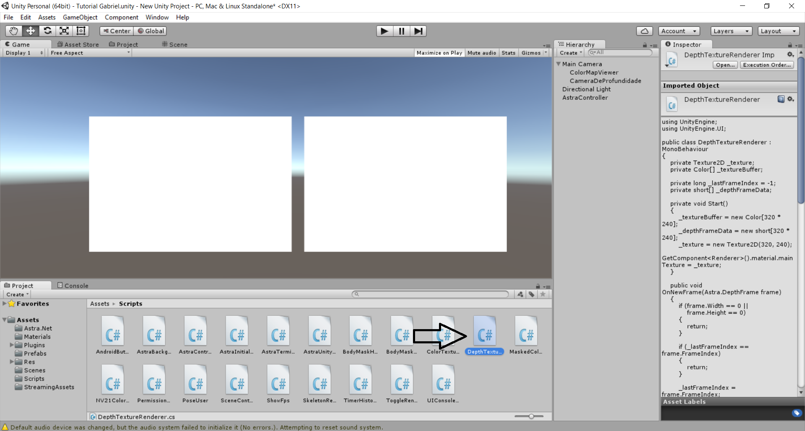
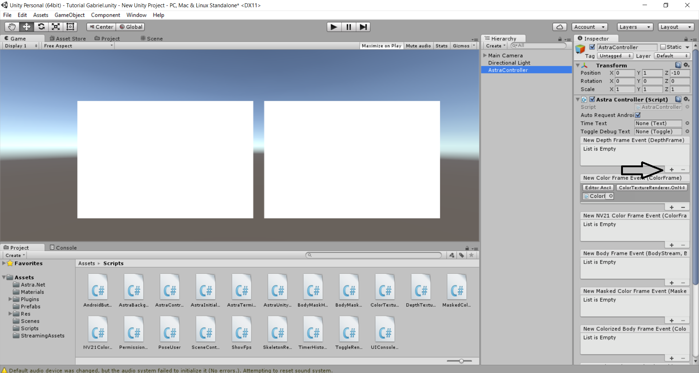
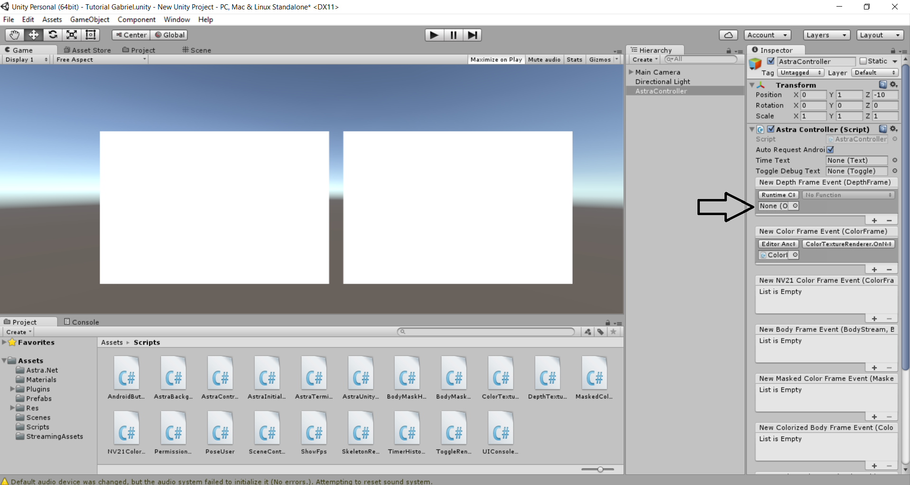
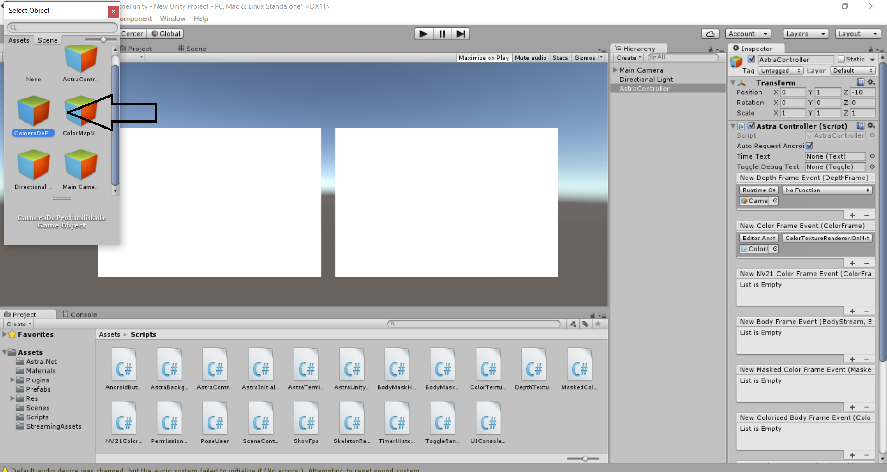
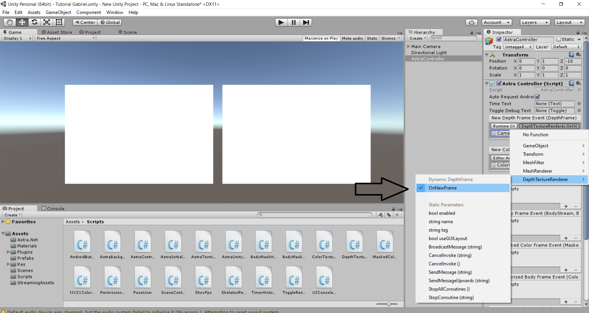
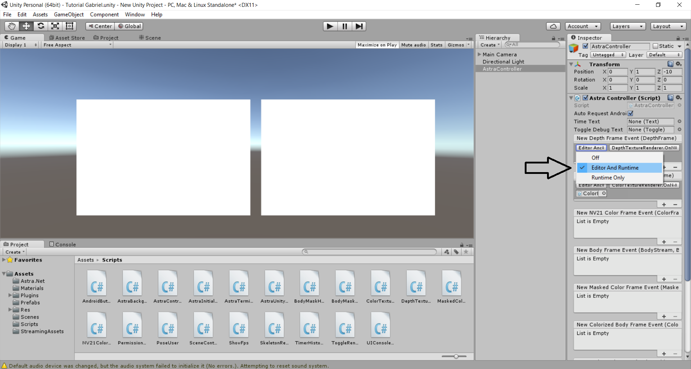

# Tutorial para utilizar a câmera ORBBEC no unity

[Instalando o driver da câmera](#instalando-o-driver-da-câmera-no-computador)

[Fazendo download do pacote de assets](#fazendo-download-do-pacote-de-assets)

[Importando o pacote de assets](#importando-o-pacote-de-assets-para-unity)

[Adicionando o Controlador da câmera](#adicionando-o-controlador-da-câmera)

[Como obter a imagem RAW da câmera](#como-obter-a-imagem-raw-da-câmera)

[Como obter a visualização do mapa de profundidade da imagem](#como-obter-a-visualização-do-mapa-de-profundidade-da-imagem)

## Instalando o driver da câmera no computador

Para o reconhecimento e funcionamento da Câmera ORBBEC ASTRA no computador, é necessário instalar drives da câmera. Para isso, deve-se acessar o site dos [desenvolvedores da ORBBEC](https://orbbec3d.com/develop/) e realizar o download dos drives compatíveis com a câmera e o sistema operacional do computador, conforme mostrado na Figura 1.

  
 Figura 1. Download dos drivers na pagina do desenvolvedor da Orbecc.

## Fazendo download do pacote de assets

No mesmo site citado anteriormente, está disponível o pacote de assets necessarios para o funcinamento da câmera na plataforma Unity,de acordo com a Figura 2. (OBS: Necessário instalar a versao 5.3.6 da [Unity](https://unity3d.com/pt/get-unity/download/archive))

  
 Figura 2. 

 
 

## Importando o pacote de assets para Unity

Depois de baixado e instalado o driver da câmera, importe do pacote de assets para Unity, como mostram as figuras de 3 a 5.

  
 Figura 3.

 

  
 Figura 4.

  
 Figura 5.

 
 

## Adicionando o Controlador da Câmera

O primeiro passo é adicionar o Controlador da Câmera. Isso é feito adicionando o script **"Astra Controller"** à um novo objeto. Para isso, crie um novo objeto clicando com o botão direito do mouse na **Janela de Hierarquia** e escolhendo a opção *"Create Empty"*. Uma vez criado o objeto, selecione o script, na pasta de scripts do pacote de assets, chamado **“Astra Controller”** e arraste para o objeto criado, consoante com as Figuras 6 e 7. \*O script também pode ser adicionado por meio do botão *"Add Component"* do objeto recém criado.
 

  
 Figura 6. Adicionando um novo objeto vazio.

 

  
 Figura 7. Selecionando o script <b>"Astra Controller"</b> para ser arrastado ao novo objeto recém criado.

                                                                                                                         
- Após adicionar o *script* **"Astra Controller"**, é apresentado 7 opções de controles distintos:
- DepthMap Viewer: É utilizado para visualização do mapa de profundidade da imagem;
- New Color Frame Event: É utilizado para a visualização da imagem colorida da câmera;
- New NV21 Color Frame event: É utilizado para a visualização da imagem colorida da câmera, no formato NV21 (Só pode ser usado quando se utilza a câmera na plataforma Android);
- New Body Frame event **\***: É utilizado para visualizar o esqueleto criado a partir da imagem da câmera;
- New Masked Color Frame event **\***: É utilizado para visualizar a máscara do objeto;
- New Colorized Body Frame event **\***: É utilizado para visualizar a máscara colorida do objeto ;
- New Body Mask event **\***: É utilizado para visualizar o teste de colisão do personagem;

**\*** *Estes modos de visualização só funcionam a partir do momento que a câmera detecta um corpo na imagem.*

## Como obter a imagem RAW da Câmera

Crie um novo objeto na aba **“Main Camera”** da Janela de Hierarquia, conforme a figura 8.

  
 Figura 8.

 

Selecione o objeto criado, clique na opção **“Add Component”** e logo após na opção **“Mesh”**,segundo a figura 9.

  
 Figura 9.

 

Selecione o componente **“Mesh Filter”**, em seguida clique no círculo que irá aparecer do lado direito da tela e depois selecione a opção **“Quad”** para que se crie a caixa onde aparecerá a imagem da câmera como mostram as seguintes, como apresentado nas figuras de 10 a 12.

  
 Figura 10.

 

  
 Figura 11.

 

  
 Figura 12.

 

Para acrescentar textura no objeto que irá transmitir a imagem da câmera adicione outro componente chamado **“Mesh Renderer”** no mesmo objeto, conforme mostra a Figura 13.

  
 Figura 13.

 

Após adicionar o **Mesh Renderer**, na aba **“Cast Shadows”** coloque em **“Off”** juntamente com a aba **“Reflection Probes”**, desmarque as caixas **“Receive Shadows”** e **“Use Light Probes”**, clique na opção **“Materials”** para escolher o tipo de textura a ser usada e depois no círculo na parte direita da tela e selecione a **“Unlit Texture”**, de acordo com as figuras de 14 a 16.
\*Depois de criar e configurar o objeto, é necessário reposicioná-lo na frente da **Main Camera**, para que ela possa pegar a imagem a ser transmitida.

  
 Figura 14.

 

  
 Figura 15.

                                                                                                                         

  
 Figura 16.

 

Selecione a pasta **scripts** dentro do pacote de **assets** que foi adicionado no início do tutorial e escolha o script **“Color Texture Renderer”** e o adicione no objeto que fornece a imagem da câmera, em conformidade com a figura 17.

  
 Figura 17.

Após esse processo, selecione o objeto de controle da câmera, criado no inicio do tutorial, selecione a opção **“New Color Frame Event”** e clique no **“+”**. Em seguida, escolha o objeto criado anteriormente na aba **“Main Camera”**, tal qual as figuras 18 e 19.

  
 Figura 18.

 

  
 Figura 19.

 

Escolha a aba **“No function”**, selecione a opção **“Color texture renderer”** e em seguida a opção **“On new frame”**, segundo a figura 20.

  
 Figura 20.

 

Após, selecione a aba **“Runtime Only”** e marque a opção **“Editor and Runtime”**, como apresenta a figura 21.

  
 Figura 21.

## Como obter a visualização do mapa de profundidade da imagem

Para obter o mapa de profundidade da câmera, primeiramente é necessário criar um novo objeto vazio dentro da aba **"Main Camera"** na **Janela de hierarquia**, como mostra a figura 22. 
\*O objeto criado também deverá ser reposicionado na frente da "Main Camera" como foi realizado na obtenção da imagem da câmera.

  
 Figura 22.

Em seguida, adicione os componentes **"Mesh Filter e Mesh Renderer"** e os configure como foi ensinado anteriormente no tópico [Como obter a imagem RAW da Câmera](#como-obter-a-imagem-raw-da-câmera).

Depois de concluir os passos acima, adicione o script **"Depth Texture Renderer"** no mesmo objeto criado anteriormente de acordo com a figura 23.

  
 Figura 23.

Selecione o objeto de **"Controle da Camera"** para configurar o objeto que irá transmitir o mapa de profundidade, em seguida clique no **"+"** logo abaixo da opção **"New Depth Frame Event"** para adicionar o objeto desejado como é observado na figura 24.

  
 Figura 24.

Posteriormente, escolha o objeto que irá transmitir o mapa de profundidade, e o configure do mesmo modo que foi feito nos passos de [Como obter a imagem RAW da Câmera](#como-obter-a-imagem-raw-da-câmera) de acordo com a figuras de 25 a 28. 

  
 Figura 25.

  
 Figura 26.

  
 Figura 27.

  
 Figura 28.

[Voltar para o inicio](#tutorial-para-utilizar-a-câmera-orbbec-no-unity)
