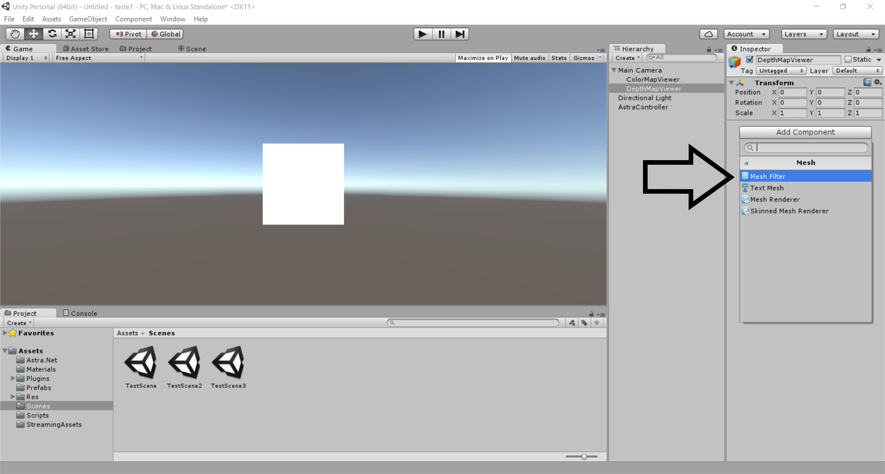

# Tutorial para utilizar a câmera ORBBEC no unity

[Instalando o driver da câmera](#instalando-o-driver-da-câmera-no-computador)

[Fazendo download do pacote de assets](#fazendo-download-do-pacote-de-assets)

[Importando o pacote de assets](#importando-o-pacote-de-assets-para-unity)

[Adicionando o Controlador da câmera](#adicionando-o-controlador-da-câmera)

[Como obter a imagem RAW da câmera](#como-obter-a-imagem-raw-da-câmera)

[Como obter a visualização do mapa de profundidade da imagem](#como-obter-a-visualização-do-mapa-de-profundidade-da-imagem)

## Instalando o driver da câmera no computador

Para o reconhecimento e funcionamento da Câmera ORBBEC ASTRA no computador, é necessário instalar drives da câmera. Para isso, deve-se acessar o site dos [desenvolvedores da ORBBEC](https://orbbec3d.com/develop/) e realizar o download dos drives compatíveis com a câmera e o sistema operacional do computador, conforme mostrado na Figura 1.

  
 Figura 1. Download dos drivers na pagina do desenvolvedor da Orbecc.

## Fazendo download do pacote de assets

No mesmo site citado anteriormente, está disponível o pacote de assets necessarios para o funcinamento da câmera na plataforma Unity,de acordo com a Figura 2. (OBS: Necessário instalar a versao 5.3.6 da [Unity](https://unity3d.com/pt/get-unity/download/archive))

  
 Figura 2. 

 
 

## Importando o pacote de assets para Unity

Depois de baixado e instalado o driver da câmera, importe do pacote de assets para Unity, como mostram as Figuras de 3 a 5.

  
 Figura 3.

 

  
 Figura 4.

  
 Figura 5.

 
 

## Adicionando o Controlador da Câmera

O primeiro passo é adicionar o Controlador da Câmera. Isso é feito adicionando o script **"Astra Controller"** em um novo objeto. Para isso, crie um objeto vazio clicando com o botão direito do mouse na **Janela de Hierarquia** e escolhendo a opção *"Create Empty"*. Uma vez criado, renomeie o objeto para o nome desejado e selecione o script **“Astra Controller”**, na pasta de scripts do pacote de assets,  e o adicione no objeto criado, consoante com as Figuras 6 a 8. \*O script também pode ser adicionado por meio do botão *"Add Component"* do objeto recém criado.
 

  
 Figura 6. Adicionando um novo objeto vazio.

 

  
 Figura 7. Selecionando o script <b>"Astra Controller"</b> para ser arrastado ao novo objeto recém criado com o nome desejado.

  
 Figura 8.

                                                                                                                         
- Após adicionar o *script* **"Astra Controller"**, são apresentadas 7 opções de controles distintos como mostra a Figura 8:
- Depth Frame: É utilizado para visualização do mapa de profundidade da imagem;
- Color Frame: É utilizado para a visualização da imagem colorida (Raw) da câmera;
- NV21 Color Frame: É utilizado para a visualização da imagem colorida da câmera, no formato NV21 (Só pode ser usado quando se utilza a câmera na plataforma Android);
- Body Frame **\***: É utilizado para visualizar o esqueleto criado a partir da imagem da câmera;
- Masked Color Frame **\***: É utilizado para visualizar a máscara do objeto;
- Colorized Body Frame **\***: É utilizado para visualizar a máscara colorida do objeto ;
- Body Mask **\***: É utilizado para visualizar o teste de colisão do personagem;

**\*** *Estes modos de visualização só funcionam a partir do momento que a câmera detecta um corpo na imagem.*

## Como obter a imagem RAW da Câmera

A imagem RAW é obtida configurando o color frame do controlador, e adicionando um objeto que será a imagem da camera na tela.

Crie um novo objeto na aba **“Main Camera”** da Janela de Hierarquia e o renomeie. Tal objeto, mostrará a imagem da câmera na tela, conforme a Figura 9.

  
 Figura 9.

 

Selecione o objeto criado, clique na opção **“Add Component”** e logo após na opção **“Mesh ... Mesh Filter”**, em seguida clique no círculo que irá aparecer do lado direito da tela e depois selecione a opção **“Quad”** para que se crie a caixa onde aparecerá a imagem da câmera como mostram as Figuras de 10 a 13.

**\*** O "Mesh Filter" recebe uma uma malha de polígonos dos seus assets, e passa essa malha ao mesh renderer para ele renderizar na tela.

  
 Figura 10.

 

  
 Figura 11.

 

  
 Figura 12.

 

  
 Figura 13.

 

Para acrescentar textura no objeto que irá transmitir a imagem da câmera adicione outro componente chamado **“Mesh Renderer”** no mesmo objeto, conforme mostra a Figura 14. 
**\*** O "Mesh Renderer" obtém a geometria do mesh filter e renderiza ela em uma possição definida pelo componente **"transform"** do gameobject (aquele que mostra a escala, rotação e posição do objeto).

  
 Figura 14.

 

Após adicionar o **Mesh Renderer**, na aba **“Cast Shadows”** coloque em **“Off”** juntamente com a aba **“Reflection Probes”** , desmarque as caixas **“Receive Shadows”** e **“Use Light Probes”**, clique na opção **“Materials”** para escolher o tipo de textura a ser usada e depois no círculo na parte direita da tela e selecione a **“Unlit Texture”**, conforme as figuras de 15 a 17.

- Cast Shadows: Especifica se e como a malha lança sombras se comporta quando uma luz adequada é aplicada sobre ela.
- Reflection Probes: Especifica como o GameObject é afetado pelas reflexões na cena. Você não pode desativar esta propriedade nos modos de renderização adiada.
- Receive Shadows: Esta opção **"Habilitada"**, faz com que a Malha exiba sombras projetadas sobre ela. 
- Use Light Probes: É o modo de interpolação de iluminação baseada em sonda. Ou seja, um Mesh recebe luz do sistema "Light Probe" , dependendo do valor que é definido.
- Materials: A aba "Materials" no Mesh Renderer, lista todos os materiais que o Mesh Renderer está usando, além de permitir a escolha de novos materiais. As malhas importadas do software de modelagem 3D podem usar vários materiais , e cada sub-malha usa um material da lista. (No caso apresentado na Figura 17, o material usado (Unlit Texture) "preenche" o "Mesh" criado anteriormente.

  
 Figura 15.

 

  
 Figura 16.

                                                                                                                         

  
 Figura 17.

Depois de criar e configurar o objeto, é necessário reposicioná-lo na frente da **Main Camera**, para que ela possa obter a imagem a ser transmitida. Para isso, selecione a opção **"Scene"**(Seta preta) para entrar no modo de configuração da cena, logo após selecione a opção de reposicionamento (Seta Azul) e escolha o lugar desejdo para mostrar a imagem da camera utilizando os vetores (Seta Amarela), de acordo com a Figura 18.

  
 Figura 18.

 

Selecione a pasta **scripts** dentro do pacote de **assets** que foi adicionado no [início do tutorial](#tutorial-para-utilizar-a-câmera-orbbec-no-unity), escolha o script **“Color Texture Renderer”** e o adicione no objeto que fornece a imagem da câmera, em conformidade com a Figura 19.

  
 Figura 19.

Após esse processo, selecione o objeto de controle da câmera, criado no [início do tutorial](#tutorial-para-utilizar-a-câmera-orbbec-no-unity), com o nome desejado, selecione a opção **“New Color Frame Event”** e clique no **“+”**. Em seguida, escolha o objeto criado anteriormente na aba **“Main Camera”**, tal qual as Figuras 20 e 21.

  
 Figura 20.

 

  
 Figura 21.

 

Selecione a aba **“No function”**, selecione a opção **“Color texture renderer”** e em seguida a opção **“On new frame”** para se obter uma imagem dinâmica da câmera, segundo a Figura 22.

  
 Figura 22.

 

Após, selecione a aba **“Runtime Only”** e marque a opção **“Editor and Runtime”**, como apresenta a Figura 23.

  
 Figura 23.

Feito isso está configurada a imagem raw da camera. Uma vez que dê o play na cena, o programa funcionará e mostrará a imagem:

Foto do funcionamento aqui.

## Como obter a visualização do mapa de profundidade da imagem

Para obter o mapa de profundidade da câmera(Depth Map Viewer), primeiramente é necessário criar um novo objeto vazio dentro do objeto **"Main Camera"** e renomeá-lo, como mostra a Figura 24. 

  
 Figura 24. Criando um novo objeto (Depth Map Viewer) para o mapa de profundidade.

Em seguida, adicione os componentes **"Mesh Filter e Mesh Renderer"** ao objeto de mapa de profundidade para que se possa transmitir a imagem, e os configure como foi ensinado anteriormente no tópico [Como obter a imagem RAW da Câmera](#como-obter-a-imagem-raw-da-câmera), de acordo com as Figuras de 25 a 31. O novo objeto também deverá ser reposicionado no campo de visão da **Main Camera** como foi realizado na obtenção da imagem RAW da câmera.

  
 Figura 25. Adicionando componente mesh filter ao objeto Depth Map Viewer.

  
 Figura 26. Selecionando opção que irá dar formato à transmissão da imagem do mapa de profundidade (Depth Map Viewer).

  
 Figura 27. Adicionando a fôrma que será transmitida a imagem do Depth Map Viewer.

  
 Figura 28. Adicionando Mesh Renderer ao objeto (Depth Map Viewer).

  
 Figura 29. Selecionando componente Mesh Renderer para configurá-lo.

  
 Figura 30. Componente conficurado (Mesh Renderer).

  
 Figura 31. Selecionando o material que será utilizado para transmitir a imagem do objeto (Depth Map Viewer).

Em seguida, é fundamental que se adicione o script **"Depth Texture Renderer"** no objeto "Depth Map Viewer" criado anteriormente de acordo com a Figura 32.

  
 Figura 32. Adicionando script "Depth Texture Renderer" ao objeto "Depth Map viewer".

Selecione o objeto de **"Controle da Camera"** para configurar o objeto que irá transmitir o mapa de profundidade, em seguida clique no **"+"** logo abaixo da opção **"New Depth Frame Event"** para adicionar o objeto desejado como é observado na Figura 33.

  
 Figura 33. Adicionando o objeto "Depth Map viewer" ao controle da câmera.

Posteriormente, escolha o objeto que irá transmitir o mapa de profundidade, e o configure do mesmo modo que foi feito nos passos de [Como obter a imagem RAW da Câmera](#como-obter-a-imagem-raw-da-câmera) de acordo com a Figuras de 34 a 36. 

  
 Figura 34. Selecionando o objeto "Depth Map viewer" na hierarquia de objetos criados.

  
 Figura 35. Configurando função do objeto ao transmitir a imagem (Selecionando opção trasmissão de imagem dinâmico).

  
 Figura 36.

Feito isso está configurada o mapa de profundidade da camera. Uma vez que dê o play na cena, o programa funcionará e mostrará a imagem:

[Voltar para o inicio](#tutorial-para-utilizar-a-câmera-orbbec-no-unity)
